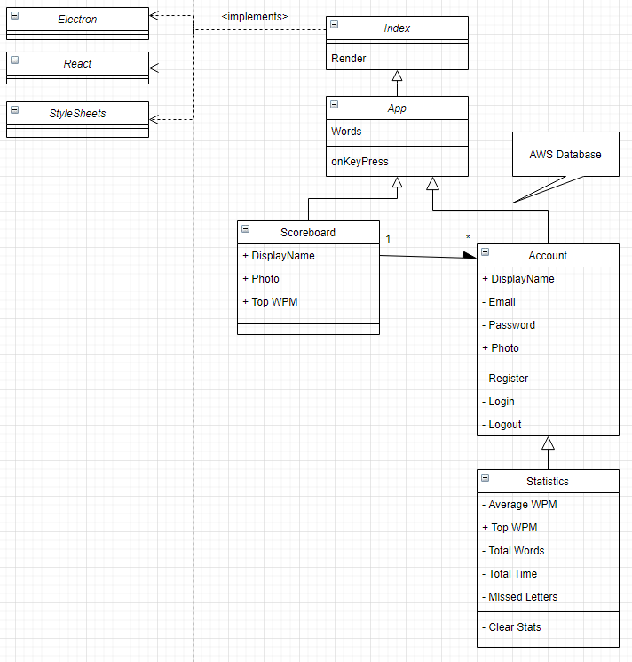
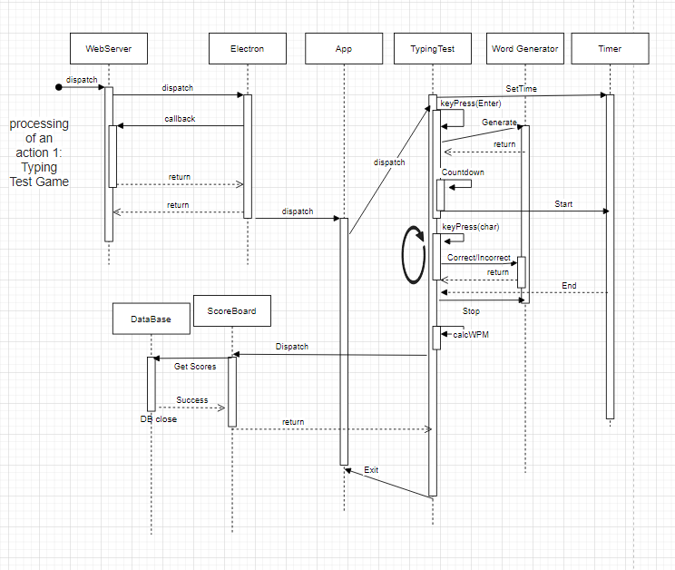
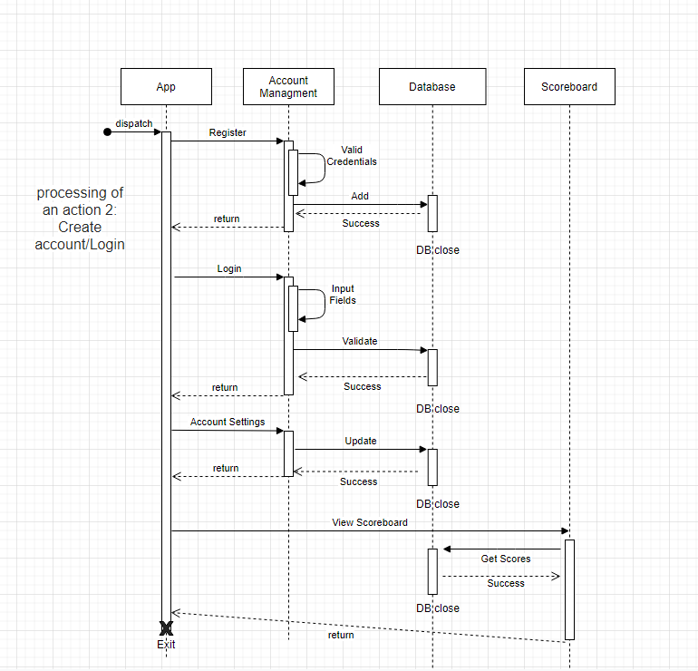
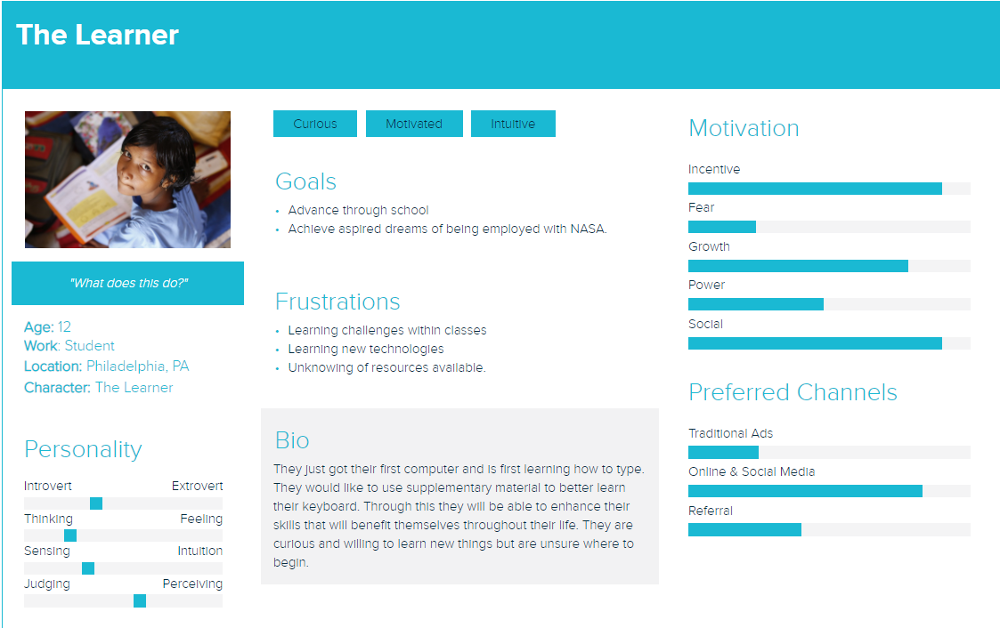
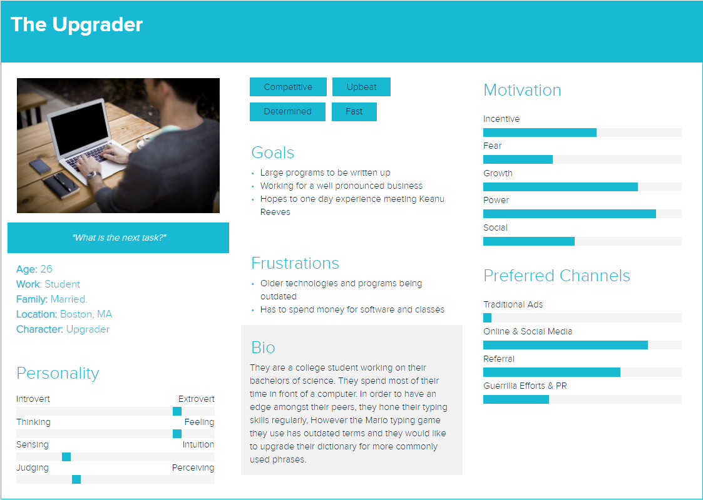
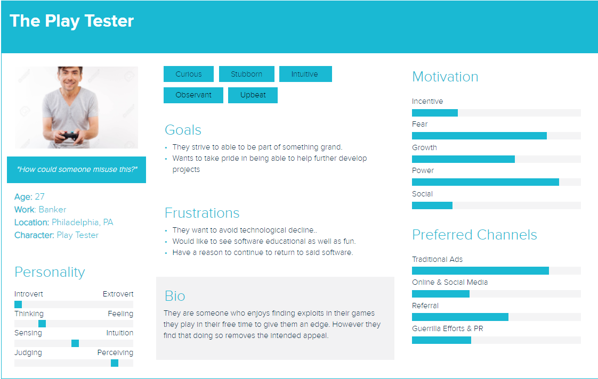

# Typing Test
### [Project Proposal](https://github.com/CIS3296SoftwareDesignF21/feedback-on-proposals-section-001-m-w-11-am/issues/14)
### [Change Log](https://github.com/CIS3296SoftwareDesignF21/prj-01-typingtest/blob/main/CHANGELOG.md)
### [Week 1 Trello](https://github.com/CIS3296SoftwareDesignF21/prj-01-typingtest/blob/main/Week1.md)
### [Week 2 Trello](https://github.com/CIS3296SoftwareDesignF21/prj-01-typingtest/blob/main/Week2.md)
### [Week 3 Trello](https://github.com/CIS3296SoftwareDesignF21/prj-01-typingtest/blob/main/Week3.md)


## Project Description

The goal of the Typing Test project is to test the user and challenge their typing skills. 
The team will be making a typing application, which will give the user a trial containing a set of words they must type out.
If the user types in the wrong word prompt, the program will not allow the user to progress until the user has correctly typed the given word.
The program will also keep track of all the errors made by the user, and present stats of how well they did at the end of the test.

We are also looking at the option of a different mode, which displays the speed in which a user can type out a set of words.
In this mode, errors made by the user wont force them to finish the word, instead, they will move on try to complete the test as fast as they can.
At the end of the speed mode, the program will present stats on the users WPM(Words per minute) and error percentage.
If we get far enough, we are hoping to display stats and records accross other players as well,
potentially having users enter their initials to display in a leaderboard.

Our vision for this project is to achieve a feature-rich program with an elegant user interface. 
Because this project is a typing test, the team arranged what we thought were the best aspects from other online typing tests into the ultimate typing test program.
By using React, we will make use of modern web UX design principles and deploy it as a desktop application with the help of [Electron.](https://www.electronjs.org)
To manage the database, we plan to take advantage of AWS AmazonRDS to host MySQL.


## Develpoer Install

[Install Node JS 16.13.0 LTS](https://nodejs.org/en/)(External Site)
clone Repo
Download Dependencies(Dependency link in github)
```
./Dependent.bat
```
```
cd typing-test
./Open.bat
npm i -D electron-devtools-installer && npm i -D concurrently@5.2.0 wait-on@5.1.0 && npm i electron-is-dev@1.2.0
```
## How to Install
- [Download Latest Release](https://github.com/CIS3296SoftwareDesignF21/prj-01-typingtest/releases/download/v0.3.0-pre-release/typing-test-win32-x64.zip)
 
- Run typing-test.exe

## Vision Statement

For any user who would like to improve their typing skills. (Typing Test) is a typing simulator that allows users to learn pratical typing skills, improve their words per minute, and gain good typing habits, all while having fun. Unlike TypeRacer, our product achieves a feature-rich program with an elegant user interface that is utilized as an executable desktop application. 

## UML
There is an Index that will have single page application using the React and Electron frameworks. There will be stylesheets to provide visual elements. The app will be the main page where the typing will be displayed. There will be multiple components within the creation of the app. Each have specifiic functionality. Title bar for navigation. Accounts for login and register, with designated attributes. Statistcs, displays users data, Scoreboard, displays global data. Use of AWS and mySQL for Database storage.


The user will open the app which uses electron and a web server to run the JS code. The user will then start playing the typing test. There are diffrent alloted times that can be chosen before play begins. Upon key press enter, a countdown will appear to signal that the tester is about to start. In that time words will be generated for the user to attempt to type correctly. The user will continue to input characters until the alloted time is complete. Upon time out, their Words Per Minute will be calculated and displayed. there will then be a scoreboard where the user can compare their scores to the top WPM users.


The user will create an account, there will be a login/register page that will be connected to the database. Upon valid credentials, the users account will be added to the database. The user will then login to the application using correct entires found by the database. After login they will go to their account page where they will update their entries. DisplayName, Email, photo, password. They will then be able to view the scoreboard including their top score as well as other users top scores, which will be retrieved from the database.


## User Personas






## Releases
- [0.1.0-pre-release](https://github.com/CIS3296SoftwareDesignF21/prj-01-typingtest/releases/download/v0.1.0/typing-test-win32-x64.rar)

- [0.2.0-pre-release](https://github.com/CIS3296SoftwareDesignF21/prj-01-typingtest/releases/download/v0.2.0-pre-release/typing-test-win32-x64.zip)

- [0.3.0-pre-release](https://github.com/CIS3296SoftwareDesignF21/prj-01-typingtest/releases/download/v0.3.0-pre-release/typing-test-win32-x64.zip)

