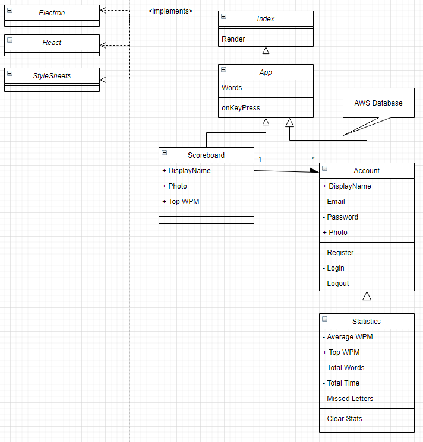
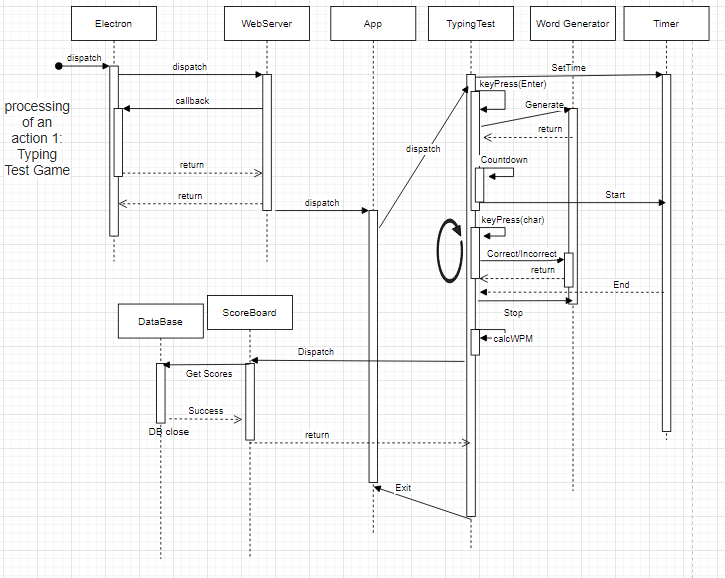
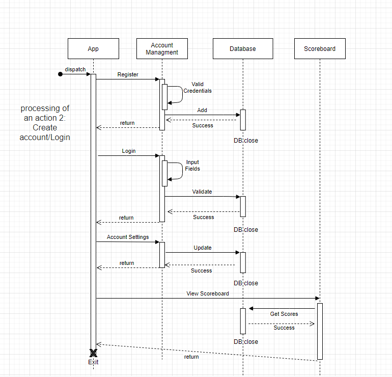

## UML
There is an Index that will have single page application using the React and Electron frameworks. There will be stylesheets to provide visual elements. The app will be the main page where the typing will be displayed. There will be multiple components within the creation of the app. Each have specifiic functionality. Title bar for navigation. Accounts for login and register, with designated attributes. Statistcs, displays users data, Scoreboard, displays global data. Use of AWS and mySQL for Database storage. 

The user will open the app which uses electron and a web server to run the JS code. The user will then start playing the typing test. There are diffrent alloted times that can be chosen before play begins. Upon key press enter, a countdown will appear to signal that the tester is about to start. In that time words will be generated for the user to attempt to type correctly. The user will continue to input characters until the alloted time is complete. Upon time out, their Words Per Minute will be calculated and displayed. there will then be a scoreboard where the user can compare their scores to the top WPM users.

The user will create an account, there will be a login/register page that will be connected to the database. Upon valid credentials, the users account will be added to the database. The user will then login to the application using correct entires found by the database. After login they will go to their account page where they will update their entries. DisplayName, Email, photo, password. They will then be able to view the scoreboard including their top score as well as other users top scores, which will be retrieved from the database.

